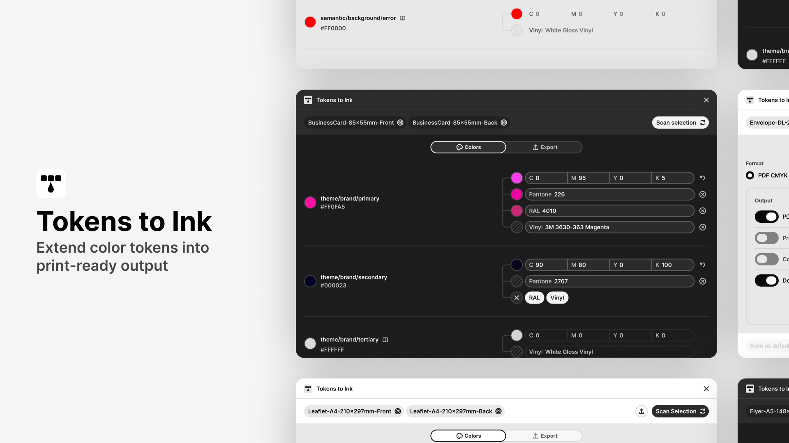

# RMS Design System

[](https://github.com/rafaelmatosdasilva/rms-ds-figma-plugins/actions/workflows/build.yml)
[](LICENSE)

The design system behind my Figma plugins, and the index of everything built with it.

**[See the living style guide](https://rafaelmatosdasilva.github.io/rms-ds-figma-plugins/)**: every token and component of the system, in light and dark.

Each product lives in its own repository, with its own releases, issues and history. Click **Watch → Custom →
Releases** on a product's repository to be notified about its new versions.

---

## Figma plugins

They run entirely inside your Figma file with no network access, no data sent anywhere, and no third party code.
Each one is on the Figma Community, and can be sideloaded from its repository's releases.

### Impact Atlas

**Trace token dependencies across your design system**

[](https://github.com/rafaelmatosdasilva/rms-figma-impact-atlas)

[Open in Figma Community](https://www.figma.com/community/plugin/1643205375147564994/impact-atlas) ·
[Repository](https://github.com/rafaelmatosdasilva/rms-figma-impact-atlas) ·
[Latest release](https://github.com/rafaelmatosdasilva/rms-figma-impact-atlas/releases/latest)

### Tokens to Ink

**Extend color tokens into print-ready output**

[](https://github.com/rafaelmatosdasilva/rms-figma-tokens-to-ink)

[Open in Figma Community](https://www.figma.com/community/plugin/1627749854119339734/tokens-to-ink) ·
[Repository](https://github.com/rafaelmatosdasilva/rms-figma-tokens-to-ink) ·
[Latest release](https://github.com/rafaelmatosdasilva/rms-figma-tokens-to-ink/releases/latest)

### Font Scaling Lab

**Stress test layouts under text scaling**

[](https://github.com/rafaelmatosdasilva/rms-figma-font-scaling-lab)

[Open in Figma Community](https://www.figma.com/community/plugin/1632816540279283797/font-scaling-lab) ·
[Repository](https://github.com/rafaelmatosdasilva/rms-figma-font-scaling-lab) ·
[Latest release](https://github.com/rafaelmatosdasilva/rms-figma-font-scaling-lab/releases/latest)

Releases before the split (tags like `impact-atlas-v6`) stay here, so old download links keep working.

---

## The design system

One package, `@rms/ds-core`, that every product pins at a version:

- `theme.css` and `ui-shared.js`: the tokens, components and shared UI, inlined into each product at build time, so
  what ships is one self-contained file;
- `@rms/ds-core/core`: shared helpers (colours, print units, focus, resize, description tags, traversal);
- `@rms/ds-core/test-utils`: a mocked `figma`, scene builders and contract checks for each product's tests;
- the build and release commands: `rms-build`, `rms-watch`, `rms-package`, `rms-check-manifests`, `rms-release`,
  `rms-release-notes`.

A product depends on it like this:

```json
"dependencies": { "@rms/ds-core": "github:rafaelmatosdasilva/rms-ds-figma-plugins#v1.0.1" }
```

The source of the system is a Figma file, kept private.

### The style guide

The [living style guide](https://rafaelmatosdasilva.github.io/rms-ds-figma-plugins/) is built from this repository by
[rms-design-system-engine](https://github.com/rafaelmatosdasilva/rms-design-system-engine) and published on GitHub Pages
by the `style guide` workflow, on every change to the system and once a week. It shows only what Figma and the code
agree on, and links to each product listed in [`products.json`](products.json). Nothing in it is written by hand: to
change it, change the system.

### Releasing a new version

Bump `version` in `package.json` and merge to main. The release workflow tags `vX.Y.Z`, and every product picks it
up: its `ds-update` workflow pins the new version, runs its tests and builds, then releases it (the next Figma
Community version, drafted on GitHub with its sideload zip), opens a pull request when its tests fail, or only
updates the pin when nothing it ships changed. Every pull request here also tests and builds each product against
the change before it can be released. Publishing in Figma Community stays a manual step.

### Adding a product

1. Create its repository, and depend on `@rms/ds-core` at the current version.
2. Copy `ds-update.yml` (and `build.yml`, `release.yml`) from a plugin repository.
3. Add it to [`products.json`](products.json) (its name, repository and Figma Community page, which the style guide
   links to) and to this README.

### Checking the system against Figma

[rms-design-system-engine](https://github.com/rafaelmatosdasilva/rms-design-system-engine) checks that the code says what
the Figma file says. Its inputs are committed here, so a check needs no access to the file: `ds-config.json`, the Figma
snapshots in `packages/ui/src/*.snapshot.json`, `bound-tokens.json`, `component-state-tokens.json`,
`structure-contract.mjs`, `contract.authored.json` and the audit history. The products are read from their own
repositories, checked out beside this one (`../rms-figma-impact-atlas` and the others, named in `pluginDirs`), so a
variable or class only a product uses counts as used.

```sh
git clone https://github.com/rafaelmatosdasilva/rms-figma-impact-atlas ../rms-figma-impact-atlas   # and each product
rms-design-system-engine
```

Refreshing the snapshots needs the Figma file, so only its owner does it (`rms-design-system-engine --recipe refresh-figma`).

## Contact

Feedback and ideas are welcome:

- Email — [hello@rafaelmatosdasilva.com](mailto:hello@rafaelmatosdasilva.com)
- LinkedIn — [rafaelmatosdasilva](https://www.linkedin.com/in/rafaelmatosdasilva/)

## License

MIT — see [LICENSE](LICENSE).
